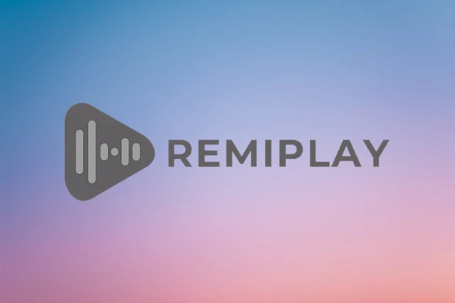

# React Video Player TypeScript Apollo GraphQL Client

React Video Player app with GraphQL Client and MUI



## Project Library

- ReactJS 18
- Vite 3
- Typescript
- MUI (Material UI)
- MUI Icon

## Start Project

To start project

```bash
git clone https://github.com/hoanghoa12345/react-video-player-app.git
npm install
npm run dev
```
